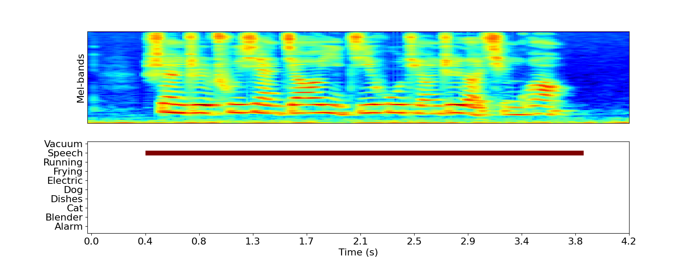
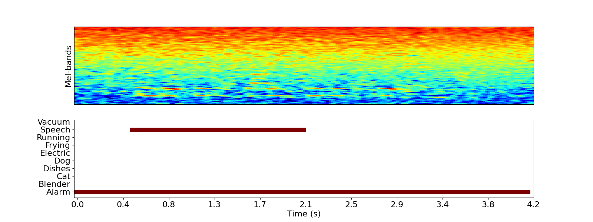
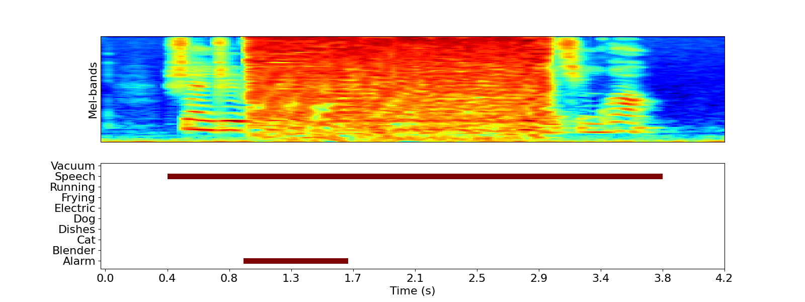
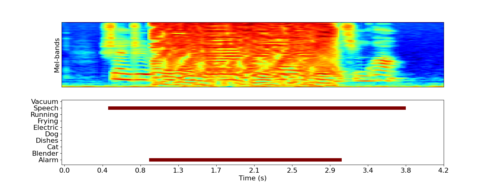

# Mirage Fools the Ear, Mute Hides the Truth: Precise Targeted Adversarial Attacks on Polyphonic Sound Event Detection Systems

[](https://arxiv.org/abs/2510.02158)

This repository provides the implementation of $\mathrm{M^2A}$, a framework for **targeted adversarial attacks** on **polyphonic Sound Event Detection (SED)** systems, together with the C&W / FAAG / ARO baselines compared in the paper. The code is released for reproducibility.

� **Paper**: [arXiv:2510.02158](https://arxiv.org/abs/2510.02158)

---

## Demos on Attack Performance of Different Methods

Attacker's goal is to activate event 'alarm' from 1.0 to 3.0s.

### Original Output



### C&W Attack



### FAAG



### $\mathrm{M^2A}$ (Ours)



---

## 📁 Repository Structure

```
M2A/
├── m2a/                          # unified attack framework
│   ├── config.py                 #   AttackConfig: one config class for every experiment
│   ├── utils.py                  #   shared helpers (metrics, SNR, losses, logging, ...)
│   ├── editors/
│   │   ├── base.py               #   generic single/multi-target optimization loop
│   │   ├── crnn.py               #   CRNN (SEDnet) adapter
│   │   └── atst_sed.py           #   ATST-SED adapter
│   ├── runner.py                 #   per-cell experiment loop (the old main())
│   └── report.py                 #   mirage+mute aggregation -> 2-D result table
├── configs/
│   ├── models/                   #   per-model hyper-parameters (paths, tau, alpha, ...)
│   │   ├── crnn.yaml
│   │   └── atst_sed.yaml
│   └── tables/                   #   batch pipelines that reproduce the paper tables
│       ├── table1_single.yaml    #   Table 1: single-target manipulation
│       └── table2_multi.yaml     #   Table 2: multi-target manipulation
├── run_attack.py                 # run one experiment cell  (model x method x attack type)
├── run_table.py                  # run a whole table and print the aggregated 2-D array
├── sed-crnn/                     # CRNN victim model (derived from the official SEDnet code)
├── ATST-SED/                     # ATST-SED victim model (official implementation)
├── AEs/                          # demo adversarial examples
├── image/                        # demo figures
└── requirements.txt
```

The victim-model directories (`sed-crnn/`, `ATST-SED/`) are kept close to
their upstream implementations; all attack logic lives once in `m2a/` and is
driven purely by the YAML configs under `configs/`.

---

## 🛠 Setup

Two environments are recommended, matching the original per-model setups.

### CRNN (`sed-crnn/`)

```bash
pip install -r requirements.txt
```

Then prepare the victim checkpoints and dataset:

* Train the four fold models with `python crnn.py` (inside `sed-crnn/`, see
  `sed-crnn/README.md` for the original instructions) and place them under
  `sed-crnn/models/` — or point `model_path` in `configs/models/crnn.yaml`
  at your own checkpoints.
* Download the [TUT sound events 2017](https://zenodo.org/record/814831)
  development dataset and put it next to `sed-crnn/`
  (`TUT-sound-events-2017-development/`), or edit `wav_dir` in the config.

### ATST-SED (`ATST-SED/`)

```bash
cd ATST-SED
bash conda_create_environment.sh   # or: pip install -r ATST-SED/requirements.txt
pip install -e .
```

* Download the fine-tuned checkpoint
  [`Stage2_wo_ext.ckpt`](https://drive.google.com/file/d/1yMv05N0Nz5mSzlQ4YBb_sqOjazPbPDhw/view?usp=sharing)
  into `ATST-SED/src/` (default `model_path`).
* Download the DESED strongly-labelled real clips
  (`DESED_dataset/strong_label_real (3373)/` next to `ATST-SED/`), or edit
  `wav_dir` in `configs/models/atst_sed.yaml`.
* If you fine-tune the model yourself, update `ATST-SED/train/confs/stage2.yaml`
  (`model_init`, `atst_init`) as described in `ATST-SED/README.md`.

---

## 🚀 Usage

### Make shortcuts

A `Makefile` wraps the common workflows:

```bash
make sync                               # uv venv (or venv+pip) + install requirements.txt
make sync-atst                          # .venv-atst + ATST-SED requirements + pip install -e ATST-SED
make env-conda                          # upstream ATST-SED conda script

make attack MODEL=crnn METHOD=m2a ATTACK=mirage
make attack MODEL=atst_sed METHOD=aro ATTACK=mute MODE=multi \
    SET="attack_iters=10 num_samples=2" # extra --set overrides
make attack-dry                         # print the resolved config only

make table1 JOBS=2                      # Table 1 (single-target) as a 2-D array
make table2 JOBS=2                      # Table 2 (multi-target)
make dry-table1                         # preview the generated cell commands
make check && make clean                # byte-compile / remove results+logs
```

`PY` / `PY_ATST` select the per-model interpreters for the table cells,
e.g. `make table1 PY_ATST=.venv-atst/bin/python` (the default for ATST
cells).

### Single experiment cell

`run_attack.py` runs one (model × method × attack_type) combination and
stores a JSON summary under `results_dir`:

```bash
# single-target mirage attack, M2A, on CRNN
python run_attack.py --config configs/models/crnn.yaml \
    --set method=m2a --set attack_type=mirage

# multi-target (3 edits) mute attack, C&W baseline, on ATST-SED
python run_attack.py --config configs/models/atst_sed.yaml \
    --set mode=multi --set edit_num=3 --set delta_duration=2.0 \
    --set method=cw --set attack_type=mute
```

Any field of the YAML can be overridden with repeated `--set key=value`.

### Method presets

| method | switches | description |
| ------ | -------- | ----------- |
| `m2a`  | preservation loss (`alpha`) | our method |
| `cw`   | `use_cw` | C&W: global perturbation, no preservation loss |
| `faag` | `use_faag` | FAAG: forward on the perturbed segment only |
| `aro`  | `use_aro` (+ `aro_beta`, `aro_ref_wav`) | ARO: adds `beta * (1 - cos(E(x_adv), E(x_ref)))` where `E` is the model's acoustic front-end and `x_ref` a reference audio containing other events |
| `custom` | explicit `use_*` flags in YAML | free combination |

### Reproducing the paper tables

`run_table.py` expands a batch config into one subprocess per
(model × method × attack_type) cell, runs them (in parallel when
`execution.jobs`/`gpus` allow), averages the `mirage` and `mute`
aggregates, and prints the result as a 2-D python array whose dimensions
match the paper tables:

```bash
python run_table.py --config configs/tables/table1_single.yaml --jobs 2
```

Output for Table 1 (`methods = [cw, faag, aro, m2a]`,
`models = [crnn, atst_sed]`):

```python
[[EP, ASR, UER, SNR, EP, ASR, UER, SNR],   # C&W   | CRNN | ATST-SED
 [EP, ASR, UER, SNR, EP, ASR, UER, SNR],   # FAAG  | CRNN | ATST-SED
 [EP, ASR, UER, SNR, EP, ASR, UER, SNR],   # ARO   | CRNN | ATST-SED
 [EP, ASR, UER, SNR, EP, ASR, UER, SNR]]   # M2A   | CRNN | ATST-SED
```

For the `aro` rows, set `cell_overrides.<model>.aro.aro_ref_wav` to an audio
clip containing other events (see `configs/tables/table1_single.yaml`).

Per-cell JSON summaries land in `results/<table>/cells/` and the final array
in `results/<table>/table.json`. Use `--dry-run` to inspect the generated
cell configs without running them.

---

## 📌 Notes

* Details of the victim models' training can be found in
  `sed-crnn/README.md` and `ATST-SED/README.md`.
* Every attack run reseeds python's `random` (and torch/numpy for CRNN)
  exactly like the original scripts; each table cell runs in its own
  process, so results match the historical one-process-per-experiment
  behaviour.
* The framework does not modify the victim models' code: `sed-crnn/` and
  `ATST-SED/` are used as libraries.

## Citation

```bibtex
@article{su2025m2a,
  title={Mirage Fools the Ear, Mute Hides the Truth: Precise Targeted Adversarial Attacks on Polyphonic Sound Event Detection Systems},
  author={Su, Junjie and Jin, Weifei and Cao, Yuxin and Wang, Derui and Ye, Kai and Hao, Jie},
  journal={arXiv preprint arXiv:2510.02158},
  year={2025}
}
```
